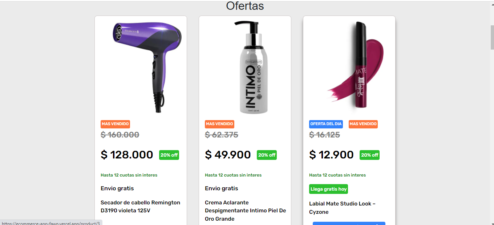
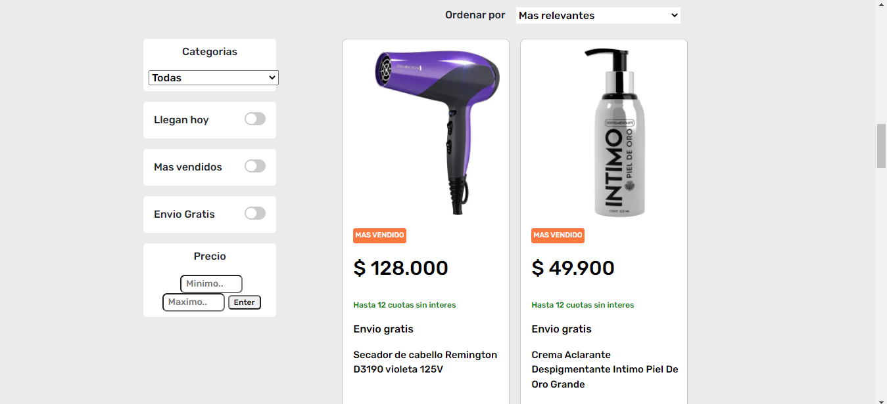
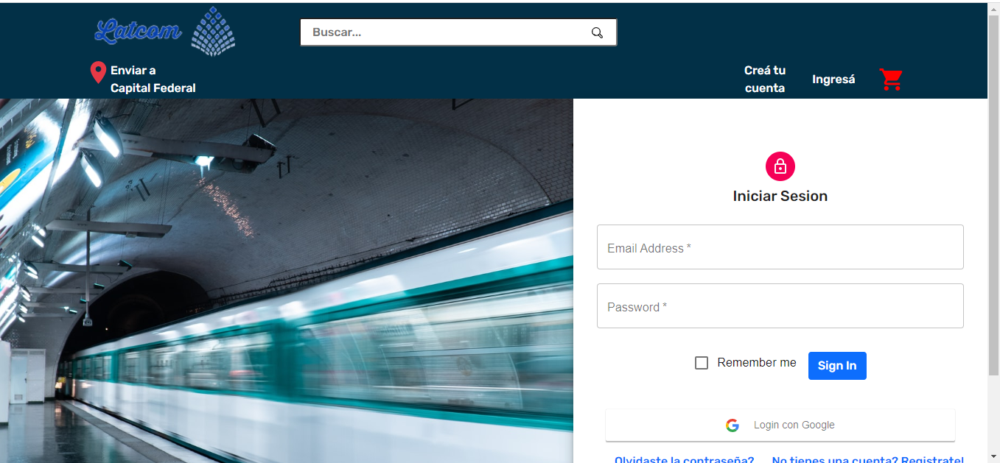
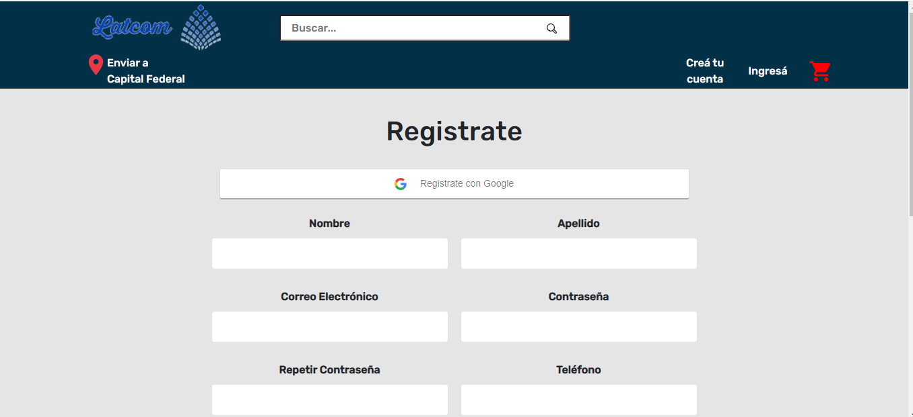

# E-Comerce_ProyectoFinal

#### Base de datos

El modelo de la base de datos deberá tener las siguientes entidades :

- [ ] Usuarios Registrados debera contar con las siguientes propiedades:
  - ID: *
  - Nombre *
  - correo electrónico *
  - Contraseña
  
- [ ] Registro Para Las Ventas Debera tener las siguientes propiedades:
  - ID
  - Pais
  - Tipo De Entidad
  - Nombre
  - Segundo Nombre
  - Apellidos
  - Pais de Nacionalidad
  - Pais De Nacimiento
  - Dia De Nacimiento
  - Mes De Nacimiento
  - Año De Nacimiento
  - Codigo Postal
  - Numero De Telefono

- [ ] Producto Debera tener las siguientes propiedades:
  - ID
  - Nombre
  - Precio
  - Detalle
 
- [ ] Categoria debera tener las siguientes propiedades:
  - ID
  - Nombre

__IMPORTANTE__: El objeto de productos debe tener las siguientes propiedades
[
  {
    ID: "1",
    name: "Tablet 10.1 Pulgadas 4G LTE Call,Android 9.0 Google Certificación GMS Tablets,3Go RAM + 32/128Go ROM",
    price: 38.000,
    categoria:"Electronicos"
    detalleSobreProducto: {
      detalle: ["Series", "Marca", "Generación", "Tamaño de la pantalla", "Sistema operativo"],
      valorDetalle: ["11-inch iPad Pro Wi-Fi 128GB - Space Gray", "Apple", "2ª generación", "11 Pulgadas", "IOS"],
      AcercaDeEsteProducto:["La pantalla táctil de 11 pulgadas con retroiluminación LED y resolución de 2388 x 1668 reproducirá todo el día.",
                             "Aligera tu carga con esta tableta ligera y entretente durante tus tiempos de inactividad con su batería de larga duración.",
                             "Con suficiente espacio de almacenamiento para hacer las cosas, esta tableta Apple viene con SSD de 128 GB de espacio en la unidad, por lo que tendrás mucha memoria para guardar datos importantes."
      ]
    },
    descripcionDelProducto: "Esta iPad Pro de 11” (2ª generación) con WiFi Only está reacondicionada certificada. Es 100% funcional y se encuentra en estado cosmético casi perfecto con la posibilidad de algunas marcas ligeras. Este artículo no viene en su embalaje original, pero incluirá un cable certificado y un adaptador de corriente aprobado por los UL. Los audífonos de diadema, la tarjeta SIM y el manual no están incluidos. Esta iPad Pro de 11” (2ª generación) solo es compatible con wifi. No está habilitada para NINGUNA red celular."
  }
]

#Imagnes Proyecto

  

 

  

 

  

 

  

 

  

 

